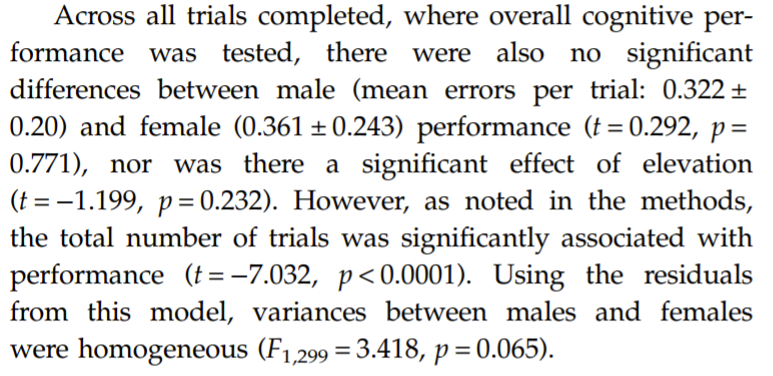
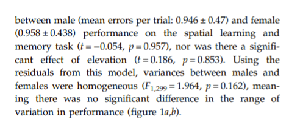
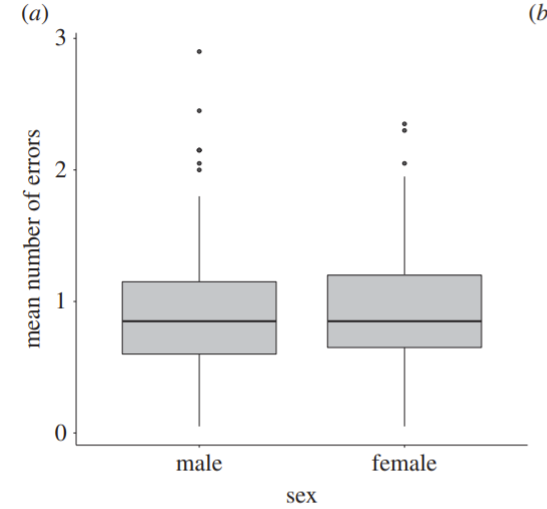
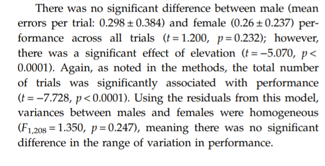
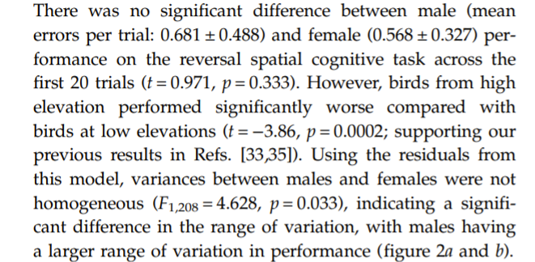
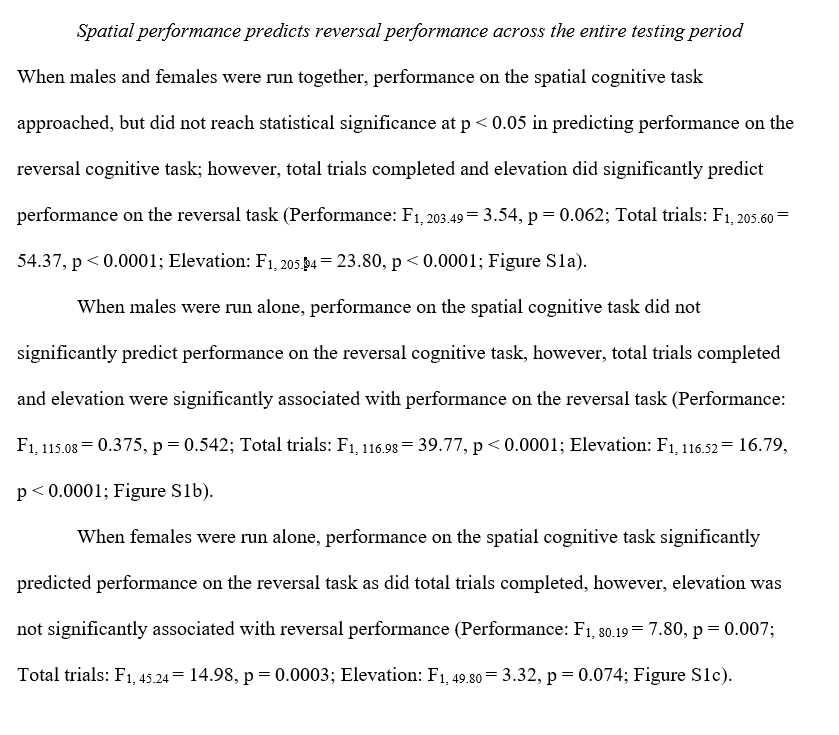
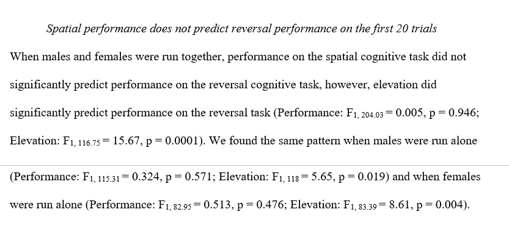

```{r}
knitr::opts_chunk$set(
	echo = TRUE,
	warning = TRUE,
	message = TRUE,
	comment = "##",
	prompt = FALSE,
	tidy = TRUE,
	tidy.opts = list(blank = FALSE, width.cutoff = 75),
	fig.path = "img/",
	fig.align = "center"
)


# INTRODUCTION AND FRAMING

# Intellectual Background of Study

#    In Branch et al. 2020, the authors set out to examine a phenomenon that has been widely discussed in the sexual selection literature and is known as the greater male variability phenomenon. Psychologists have repeatedly found that male humans exhibit larger variation in their cognitive abilities than females, leading to similar mean performance between the sexes but a larger variance in males. In nonhuman animals, a phenomenon known as the “lek paradox” has been observed. This paradox refers to the fact that significant variation in male phenotypes persists generation after generation, despite the fact that females exhibit strong preferences for particular phenotypes. These phenotypes tend to reliably reflect male condition, and females preferentially mate with males in good condition. In previous studies with mountain chickadees, the authors have found spatial cognitive ability to predict survival and to be associated with female reproductive decisions. Drawing on the research traditions of male cognitive variability in humans and male phenotypic variability in nonhuman animals, the authors posit that, in mountain chickadees, cognitive ability reflects male condition and will show wider variance in males. 


# Experimental Setup    To test their hypothesis about male variability, the authors examined male and female cognition in the wild at two study sites ( a high elevation and a low elevation study site) across four winters. They administered two kinds of cognitive tests to the chickadees: a spatial learning and memory task (a proxy for spatial cognitive abilities) and a reversal learning task (a proxy for cognitive flexibility). Birds were habituated to arrays of eight feeders feeder for at least two weeks prior to testing, and birds that consistently visited the feeder arrays were pseudo-randomly assigned to a feeder. The spatial cognitive task involved selecting the feeder within the array that the individual had been assigned to (which, after the testing period began, was the only feeder that would provide the individual food). Performance was measured by counting the number of location errors that a bird made during each “trial,” which began when the bird visited any feeder within an array and ended once the bird visited the correct, rewarded feeder. The researchers calculated the mean number of location errors per trial for the first 20 trials and for each of the entire testing periods (each winter season). The average number of errors per trial was calculated separately for the first 20 trials and all of the trials because the first 20 trials were expected to be a significant initial learning and memory acquisition period for the chickadees.                             For the reversal learning task, immediately after each spatial learning and memory testing period, tested birds were assigned to a new feeder location within the array. In each trial, the number of feeders visited before visiting the newly rewarding feeder was used to calculate the mean number of location errors per trial. And once again, the average number of errors per trial was calculated separately for each individual across the first 20 trials and across all of the trials in each season.   


# Data Analysis  To assess differences in performance between males and females, the authors ran two general linear mixed models (GLMMs) for the spatial learning and memory task and two models for the reversal learning task. For both tasks, one model was run with performance (average number of errors per trial) in the first 20 trials as a response variable, and another model was run with performance across all trials as a response variable. Sex and elevation were run as fixed factors and testing year and individual ID were run as random factors. Total number of trials was used as a fixed factor in the total trials analyses to control for the effect of motivation on performance.                           In addition to these tests examining mean performance, the authors assessed sex differences in the range of variance in performance on spatial and reversal learning by testing for homogeneity of variances between males and females on both tasks (using Levene’s test). This test was performed for both the first 20 trials of each cognitive task and for all of the trials for each task. Levene’s test allows the central prediction of the study to be tested, which is that males and females will have similar mean performances, but different variances. Additionally, the authors assessed whether individuals that performed well on the spatial learning and memory task also performed well on the reversal learning task. For each of four GLMMs, performance on reversal learning either across all trials or in the first 20 trials was the response variable, and performance on the spatial learning and memory task and elevation were fixed effects, while test year and ID were random effects. For the total trials analyses, the total number of trials was included as a fixed effect as well (since total number of trials was highly correlated with overall performance in both tasks).  
# Results      In the first 20 trials of the spatial learning task, the authors found no significant difference between male and female performance, nor a significant effect of elevation. There was also no significant difference in the range of variation in performance. Across all trials, there was also no significant differences between male and female performance, no significant effect of elevation, and there was no significant difference in the range of variation in performance. Importantly, however, the total number of trials was significantly associated with reversal learning performance. In the first 20 trials of the reversal learning task, there was no significant difference between male and female performance. There was, however, a significant difference in the range of variation between males and females. Across all trials, there was no significant difference between male and female performance, nor was there a significant difference in the range of variation. There was a significant effect of elevation and a significant effect of the total number of trials. The range of variation in performance did not differ between males and females.                                                The authors interpret the results to support their hypothesis that spatial learning ability and cognitive flexibility would not differ between the sexes, because both cognitive abilities are so critical for the survival of mountain chickadees. They interpret the finding of greater male variability in reversal learning to support their prediction of greater male variability and propose the idea that reversal learning ability may be more flexible and condition-dependent, whereas spatial cognition has become more canalized over time due to intense natural selection pressure. Thus, spatial learning abilities might not vary in the same way that secondary sexual traits do in many classic examples of the lek paradox. Overall, they conclude that their study leads to more questions and answers, though it does provides a convincing example of the male variability phenomenon in a nonhuman animal.


# Reanalysis Setup and Objectives

#   In this attempt at reanalysis, I will replicate the linear mixed effects models that the authors ran on mean performance across all trials and in the first 20 trials for both cognitive tasks. I will estimate least squares means of the fixed effects in these four models. In addition, I will run homogeneity of variance tests using Levene's test to examine whether variance in cognitive performance differs between the sexes along with each of the four linear mixed effects models that I run. In addition to replicating the models that form the centerpiece of the original paper, I will replicate a comparison between reversal task performance and spatial learning performance from the supplementary material, to examine whether performance on one task predicted performance on the other in the first 20 trials and across all trials. I will replicate comparisons that include both sexes as well as comparisons with males only and with females only, to assess whether the relationship between performances on different tasks varies by sex.

```

```{r}


# loading in dataset 

library(curl)
f <- curl("https://raw.githubusercontent.com/inmanc2/replication-assignment/main/MOCHTesting_15_19_NAoutliersremoved.csv")
d <- read.csv(f, header = TRUE, sep = ",", stringsAsFactors = FALSE)
head(d)


# loading packages


library(tidyverse)

library(lme4)

library(lmtest)

library(broom)

library(nlme)

library(car)
library(lsmeans)

# First, I will run some descriptive summary statistics on the spatial learning performance across all trials and the spatial learning performance in the first 20 trials.

head(d)

names(d)

str(d)

# mean number of errors per trial across all trials

mean(d$I.Tot.LocErr, na.rm = TRUE)

# median number of errors per trial across all trials

median(d$I.Tot.LocErr, na.rm = TRUE)

# standard deviation of number of errors per trial across all trials

sd(d$I.Tot.LocErr, na.rm = TRUE)

# mean number of errors per trial in the first 20 trials

mean(d$I.20.LocErr, na.rm = TRUE)

# median number of errors per trial in the first 20 trials

median(d$I.20.LocErr, na.rm = TRUE)

# standard deviation of the number of errors per trial in the first 20 trials

sd(d$I.20.LocErr, na.rm = TRUE)

# boxplot comparing errors per trial in the first 20 trials to errors per trial across all trials in the spatial learning task

par(mfrow = c(1, 2))
boxplot(d$I.Tot.LocErr, ylab = "Total Errors Per Trial Across All Trials")
boxplot(d$I.20.LocErr, ylab = "Total Errors Per Trial In First 20 Trials")

```


```{r}

# The code below creates a linear mixed effects model to test for effects of sex, elevation, and the number of total trials on the number of errors per trial (a measure of performance) averaged across all trials. The number of location errors per trial averaged across all trials is the response variable. Sex, elevation, and the number of total trials are fixed effects, while test year and ID number are random effects. 

tot_lme <- lmer(I.Tot.LocErr ~ Sex + Elevation + I.TotTrials + (1 | TestYear) + (1 | RFID), data = d)
summary(tot_lme)

# The code below calculates least squares means estimating the effect of sex on location errors per trial.

tot_lsme <- lsmeans(tot_lme, pairwise ~ Sex, adjusted = "tukey")

summary(tot_lsme)

# There was no significant effect of sex on number of errors per trial averaged across all trials.

# The code below calculates least squares means estimating the effect of elevation on location errors per trial.

tot_lsme1 <- lsmeans(tot_lme, pairwise ~ Elevation, adjusted = "tukey")

summary(tot_lsme1)

# There was no significant effect of elevation on number of errors per trial averaged across all trials.


leveneTest(I.Tot.LocErr ~ Sex, data = d)

# There are no significant differences in variance by sex in total mean errors.

# For purposes of comparison, a screenshot of the results section for number of spatial learning errors per trial across all trials is linked below.

TotLocErr_Results <- "https://github.com/inmanc2/replication-assignment/raw/main/img/TotLocErr_Results.png"

download.file(TotLocErr_Results, 'TotLocErr_Results.png', mode = 'wb')



```


```{r}

# The code below creates a linear mixed effects model to test for effects of sex and elevation on the number of errors per trial (a measure of performance) in the first 20 trials. The number of location errors per trial averaged across the first 20 trials is the response variable. Sex and elevation are fixed effects, while test year and ID number are random effects. 

first20_lme <- lmer(I.20.LocErr ~ Sex + Elevation +
  (1 | TestYear) + (1 | RFID), data = d)

# The code below calculates least squares means estimating the effect of sex on the number of errors per trial in the first 20 trials.

first20_lsme <- lsmeans(first20_lme, pairwise ~ Sex, adjusted = "tukey")

summary(first20_lsme)

# There is no significant effect of sex on average number of location errors per trial in the first 20 trials.

library(car)

leveneTest(I.20.LocErr ~ Sex, data = d)

# There is no significant difference in variance by sex in mean errors across the first 20 trials. 

first20_lsme1 <- lsmeans(first20_lme, pairwise ~ Elevation, adjusted = "tukey")

summary(first20_lsme1)

# There is no significant effect of elevation on average performance in first 20 trials.

# For purposes of comparison, a screenshot of the results section for number of spatial learning errors per trial across the first 20 trials is linked below.

TwentyLocErr_Results <- "https://github.com/inmanc2/replication-assignment/raw/main/img/20LocErr_Results.png"

download.file(TwentyLocErr_Results, '20LocErr_Results.png', mode = 'wb')



# The code below creates boxplots comparing male and female performance in the first 20 trials of the spatial learning task.

library(ggplot2)

first20_plot <- ggplot(data = d, aes(x = Sex, y = I.20.LocErr))
first20_plot <- first20_plot + geom_boxplot(na.rm = TRUE)
first20_plot <- first20_plot + ylab("mean number of errors")
first20_plot <- first20_plot + xlab("sex")
first20_plot

# For purposes of comparison, a screenshot of similar boxplots generated in the text of the original paper is linked and downloaded here.
Screenshot_first20bysex_boxplot <- "https://github.com/inmanc2/replication-assignment/raw/main/img/Screenshot_first20bysex_boxplot.png"

download.file(Screenshot_first20bysex_boxplot, 'Screenshot_first20bysex_boxplot.png', mode = 'wb')




```


```{r}

# REVERSAL LEARNING TASK ANALYSIS

# The code below creates a linear mixed effects model to test for effects of sex, elevation, and the number of total trials on the number of errors per reversal learning trial (a measure of performance) averaged across all trials. The number of location errors per trial averaged across all trials is the response variable. Sex, elevation, and the number of total trials are fixed effects, while test year and ID number are random effects.

tot_lme1 <- lmer(R.Tot.LocErr ~ Sex + Elevation + R.TotTrials + (1 | RFID) + (1 | TestYear), data = d)

tot_lsme2 <- lsmeans(tot_lme1, pairwise ~ Sex, adjusted = "tukey")

summary(tot_lsme2)

# There is no significant effect of sex on mean reversal learning performance per trial averaged across all trials.

library(car)

leveneTest(R.Tot.LocErr ~ Sex, data = d)

# There is no significant difference in variance between the sexes on mean reversal learning performance per trial averaged across all trials.


tot_lsme3 <- lsmeans(tot_lme1, pairwise ~ Elevation, adjusted = "tukey")

summary(tot_lsme3)


# There is a significant effect of elevation on mean reversal learning performance per trial averaged across all trials.

tot_lsme4 <- lsmeans(tot_lme1, pairwise ~ R.TotTrials, adjusted = "tukey")

summary(tot_lsme4)

# For purposes of comparison, a screenshot of results for total reversal learning trials is linked and downloaded here. 

TotRevErr_Results <- "https://github.com/inmanc2/replication-assignment/raw/main/img/TotRevErr_Results.png"

download.file(TotRevErr_Results, 'TotRevErr_Results.png', mode = 'wb')



```

```{r}

# The code below creates a linear mixed effects model to test for effects of sex and elevation on the number of errors per reversal learning trial (a measure of performance) averaged across the first 20 trials. The number of location errors per trial in the first 20 trials is the response variable. Sex and elevation are fixed effects, while test year and ID number are random effects.

first20_lme1 <- lmer(R.20.LocErr ~ Sex + Elevation + (1 | RFID) + (1 | TestYear), data = d)


# The code below computes least squares means for the effect of elevation on the number of reversal learning errors per trial in the first 20 trials.


first20_lsme2 <- lsmeans(first20_lme1, pairwise ~ Elevation, adjusted = "tukey")

summary(first20_lsme2)


# There was a significant effect of elevation on average performance across the first 20 trials.

first20_lsme3 <- lsmeans(first20_lme1, pairwise ~ Sex, adjusted = "tukey")

summary(first20_lsme3)

# There was no significant effect of sex on average performance across the first 20 trials.

leveneTest(R.20.LocErr ~ Sex, data = d)

# There was a significant difference in variance between males and females in reversal learning performance, averaged across the first 20 trials.

# For purposes of comparison, a screenshot of results for the first 20 reversal learning trials is linked and downloaded here. 

First20RevErrors_Results <- "https://github.com/inmanc2/replication-assignment/raw/main/img/First20RevErrors_Results.png"

download.file(First20RevErrors_Results, 'First20RevErrors_Results.png', mode = 'wb')



```


```{r}

# COMPARING SPATIAL LEARNING PERFORMANCE TO REVERSAL LEARNING PERFORMANCE


# The code below creates a linear mixed effects model to test for an effect of number of errors per spatial learning trial across all trials, elevation, and total number of trials on the number of errors per reversal learning trial (a measure of performance) averaged across all trials. The number of location errors per trial across all trials is the response variable. Sex, elevation, and the total number of trials are fixed effects, while test year and ID number are random effects.

predict_lme <- lmer(R.Tot.LocErr ~ I.Tot.LocErr + Elevation + R.TotTrials + (1 | RFID) + (1 | TestYear), data = d)

# The code below runs an Anova test (analysis of variance), which separates observed variance into different components and allows us to see what the effect of each of the different fixed factors in our model is on the response variable. This is ideal for looking at the impact of one continuous variable on an another.

car::Anova(predict_lme)

# Elevation significantly predicts overall reversal performance, as does the total number of reversal trials. Performance on spatial/cognitive tasks is a near-significant predictor of reversal performance

# The code below creates a linear mixed effects model examining the relationship between performance in the first 20 trials of the spatial learning task and performance in the first 20 trials of the reversal learning task for males.


males_only_alltrials <- filter(d, Sex == "M")

# The code below creates a linear mixed effects model for predicting male performance in the reversal learning task from male performance in the spatial learning task across all trials.

predict_lme_males <- lmer(R.Tot.LocErr ~ I.Tot.LocErr + Elevation + R.TotTrials + (1 | RFID) + (1 | TestYear), data = males_only_alltrials)

# The code below creates an ANOVA for analyzing fixed effects on male performance across all trials.

car::Anova(predict_lme_males)

# Among males, elevation significantly predicts total number of location errors per trial across all trials. Number of total reversal learning trials also significantly predicts total number of location errors per trial across all trials.

# Here, the same model is run in females only.

females_only_alltrials <- filter(d, Sex == "F")

predict_lme_females <- lmer(R.Tot.LocErr ~ I.Tot.LocErr + Elevation + R.TotTrials + (1 | RFID) + (1 | TestYear), data = females_only_alltrials)

# An ANOVA is run for analyzing fixed effects on female performance across all trials.

car::Anova(predict_lme_females)

# In females, average number of errors per trial across all trials significantly predicts performance on reversal learning, as does the total number of trials. Interestingly, elevation does NOT predict performance on reversal learning in females (even though it does in males).

# For purposes of comparison, a screenshot of comparing reversal to spatial learning results across all trials is linked and downloaded below. The paragraph can be found in the supplemental material of the original paper.

Comparingcognitiveperformance_alltrials <- "https://github.com/inmanc2/replication-assignment/raw/main/img/Comparingcognitiveperformance_alltrials.png"

download.file(Comparingcognitiveperformance_alltrials, 'Comparingcognitiveperformance_alltrials.png', mode = 'wb')




```

```{r}

# COMPARING SPATIAL LEARNING PERFORMANCE TO REVERSAL LEARNING PERFORMANCE IN THE FIRST 20 TRIALS


# The code below creates a linear mixed effects model examining the relationship between performance in the first 20 trials of the spatial learning task and performance in the first 20 trials of the reversal learning task. Performance in the first 20 reversal learning trials is the response variable, and performance in the first 20 spatial learning trials and elevation are fixed factors. ID number and test year are random effects.

predict_lme_first20 <- lmer(R.20.LocErr ~ I.20.LocErr + Elevation + (1 | RFID) + (1 | TestYear), data = d)

# The code below creates an ANOVA for separating the effects of the different fixed factors.

car::Anova(predict_lme_first20)

# Performance on spatial memory in first 20 trials did not significantly predict performance on reversal learning in first 20 trials. Elevation does significantly predict performance on reversal learning in first 20 trials.


# The same model is run for males only.

lme_males_first20 <- lmer(R.20.LocErr ~ I.20.LocErr + Elevation + (1 | RFID) + (1 | TestYear), data = males_only_alltrials)

# A similar ANOVA is run for males only to separate effects of the different fixed factors.

car::Anova(lme_males_first20)

# Among males, elevation significantly predicts number of location errors per reversal learning trial across the first 20 trials. Among males, number of location errors per trial in the first 20 spatial/cognitive task trials does not predict performance in the reversal learning task.


first20_lme_females <- lmer(R.20.LocErr ~ I.20.LocErr + Elevation + (1 | RFID) + (1 | TestYear), data = females_only_alltrials)

car::Anova(first20_lme_females)

# Elevation significantly predicts female reversal learning performance across the first 20 trials. Female spatial learning performance across the first 20 trials does NOT predict female reversal learning performance across the first 20 trials.

# For purposes of comparison, a screenshot comparing reversal to spatial learning results in the first 20 trials is linked and downloaded below. The paragraph can be found in the supplemental material of the original paper.

Comparingcognitiveperformance_first20trials <- "https://github.com/inmanc2/replication-assignment/raw/main/img/Comparingcognitiveperformance_first20trials.png"

download.file(Comparingcognitiveperformance_first20trials, 'Comparingcognitiveperformance_first20trials.png', mode = 'wb')



               
               
```


```{r}
# Discussion and Reflection

  # As evidenced by comparisons between results sections in the original paper and in the original supplementary material and the R output I generated, my replications were largely successful. For all of the comparisons of least squares means (run using the lsmeans() function) based on the linear mixed effects model output, I obtained very similar t-values and p-values. In some cases, the values were identical. Even when values differed somewhat, I found the same effect (or lack of effect) as the authors did in all of the inferential tests I ran. The authors presented their data in straightforward ways, and they clearly explained the components of the linear mixed effects models that they ran. These explanations and rationale were clear even to someone who had never worked with these models before.                                                          The one piece of my replication that I am unsure about is the implementation of Levene's test. According to every source I could find, the code I used to implement Levene's test for homogeneity of variance was correct. The values I obtained for the four Levene's tests that I ran all showed the same homogeneity of variance (or lack thereof) as was found in the original results, but the values I calculated tended to differ a lot more widely from the original results than in all of the other tests I ran. It is important to get this part of the replication right, as testing for homogeneity of variance is at the foundation of this study! I noticed that the supplemental material mentions that the Levene's tests were conducted for the residuals of each mixed model. Even though it makes sense to me that residuals would be a useful way of detecting differences in variance between groups, I was not sure how to incorporate residual analysis into my code. I also was not sure whether or not residuals were something that Levenetest() command already uses to compute its results. Overall, I was confused about this operation but happy that, even in my possibly flawed implementation of Levene's test, I arrived at the same conclusions about homogeneity of variance as the authors.                                    


```


